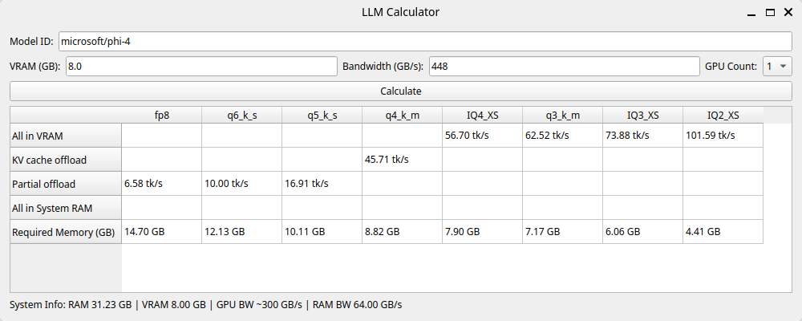

# LLM Calculator

This tool estimates the memory requirements and performance of Hugging Face models based on quantization levels. It fetches model parameters, calculates required memory, and analyzes performance with different RAM/VRAM configurations.

Supports Windows, Linux, and macOS, as well as AMD, Intel, and Nvidia GPUs. If you're using an Nvidia GPU, you'll need `nvidia-smi` (which comes with the CUDA toolkit) installed for detection.

**Warning:** This tool is mostly tested on Linux + Nvidia. Results may be inaccurate on other setups. Multi-GPU support is experimental—if it doesn't work, use `-n` to specify the number of identical GPUs. If you're mixing GPUs (e.g., RTX 3070 + RTX 3060), manually set `-v` and `-b` to the averaged values.

---

## Installation & Setup

You'll need Python (3.12.3 recommended, but any modern version should work).

### 1. Install Dependencies
Install [uv](https://docs.astral.sh/uv/getting-started/installation/) and run:
```sh
uv run main.py  # For GUI
uv run LLMcalc.py  # For CLI
```

For AMD + Linux:
```sh
sudo apt install pciutils
```

For Nvidia:
- Ensure drivers are installed.
- If `nvidia-smi` works, this program should too.

For Intel:
- Requires `lspci` (Linux). Not sure about Windows support.

---

## Usage

### GUI Mode
Run:
```sh
python main.py
```
This launches a graphical interface where you can enter a Hugging Face model ID (e.g., `microsoft/phi-4`) to see its parameter count and memory requirements.

### CLI Mode
Run:
```sh
python LLMcalc.py
```
By default, it auto-detects your hardware. You can manually specify values with flags:

#### Flags
```
-b, --bandwidth  Override memory bandwidth (GB/s)
-n, --num-gpus   Number of GPUs (default: 1)
-v, --vram       Override VRAM amount per GPU (GB)
```
Example:
```sh
python LLMcalc.py -b 950 -n 2 -v 24
```

---

## How It Works
- Enter a Hugging Face model ID (e.g., `microsoft/phi-4`).
- The script fetches system RAM and VRAM specs.
- It analyzes memory requirements for different quantization schemes and estimates throughput (tk/s).
- Hover over a cell in the GUI to see:
  - How many layers you need to offload.
  - The max context length without KV cache quantization.

### Sample Output

```
FP8:
Run Type: Partial offload
Memory Required: 14.70 GB
GPU Offload Percentage: 54.4%
Estimated tk/s: 6.58
Max Context Length: 16384 tk

Q6_K_S:
Run Type: Partial offload
Memory Required: 12.13 GB
GPU Offload Percentage: 66.0%
Estimated tk/s: 10.00
Max Context Length: 16384 tk

Q5_K_S:
Run Type: Partial offload
Memory Required: 10.11 GB
GPU Offload Percentage: 79.2%
Estimated tk/s: 16.91
Max Context Length: 16384 tk

Q4_K_M:
Run Type: KV cache offload
Memory Required: 8.82 GB
Estimated tk/s: 30.61
Max Context Length: 16384 tk

IQ4_XS:
Run Type: All in VRAM
Memory Required: 7.90 GB
Estimated tk/s: 37.97
Max Context Length: 517 tk

Q3_K_M:
Run Type: All in VRAM
Memory Required: 7.17 GB
Estimated tk/s: 41.86
Max Context Length: 4371 tk

IQ3_XS:
Run Type: All in VRAM
Memory Required: 6.06 GB
Estimated tk/s: 49.47
Max Context Length: 10151 tk

IQ2_XS:
Run Type: All in VRAM
Memory Required: 4.41 GB
Estimated tk/s: 68.03
Max Context Length: 16384 tk
```



